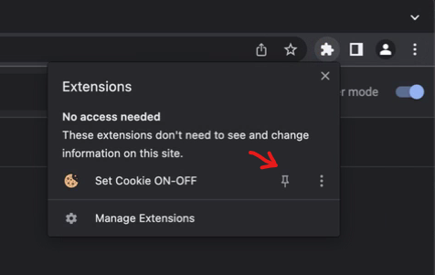
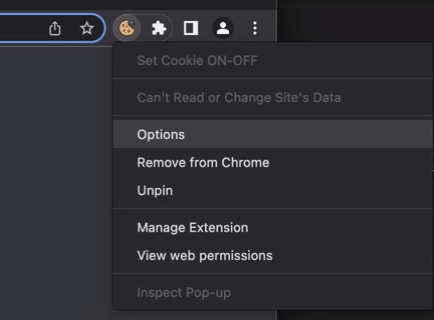
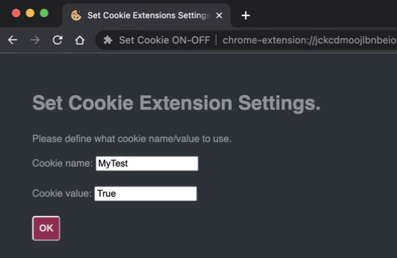

# set-cookie-on-off Chrome Extension
Chrome extension to manage a single development feature toggle cookie.

## Install

1. Go to Google store and install

2. Make toolbar icon visible

### Intial config

1. Right click the extension icon and go to options.

2. Enter desired cookie name and value in the extension settings.

## Usage

Toolbar icon will show if you are using the configured cookie. Click toolbar icon to set or unset the configured cookie.

- `ON` = Cookie is set
- `OFF` = Cookie is not set

## Install for development use

https://developer.chrome.com/docs/extensions/mv3/getstarted/development-basics/#load-unpacked
